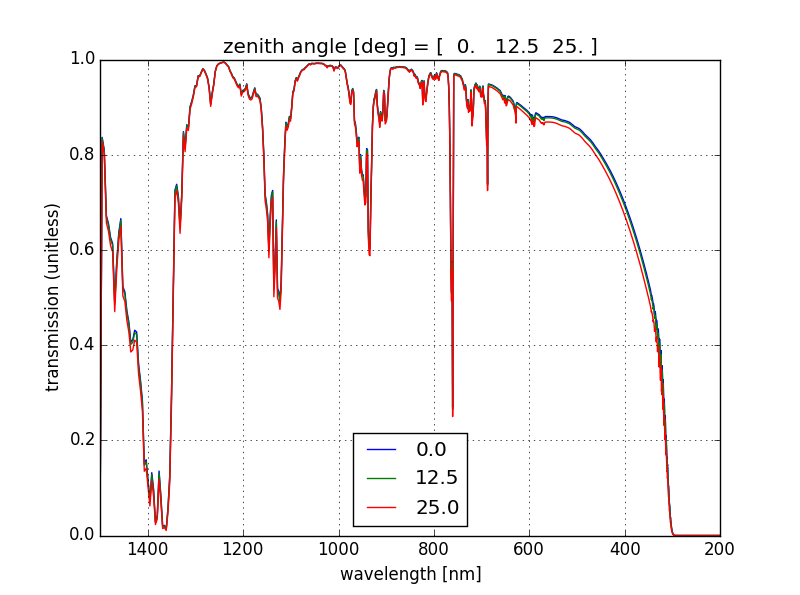
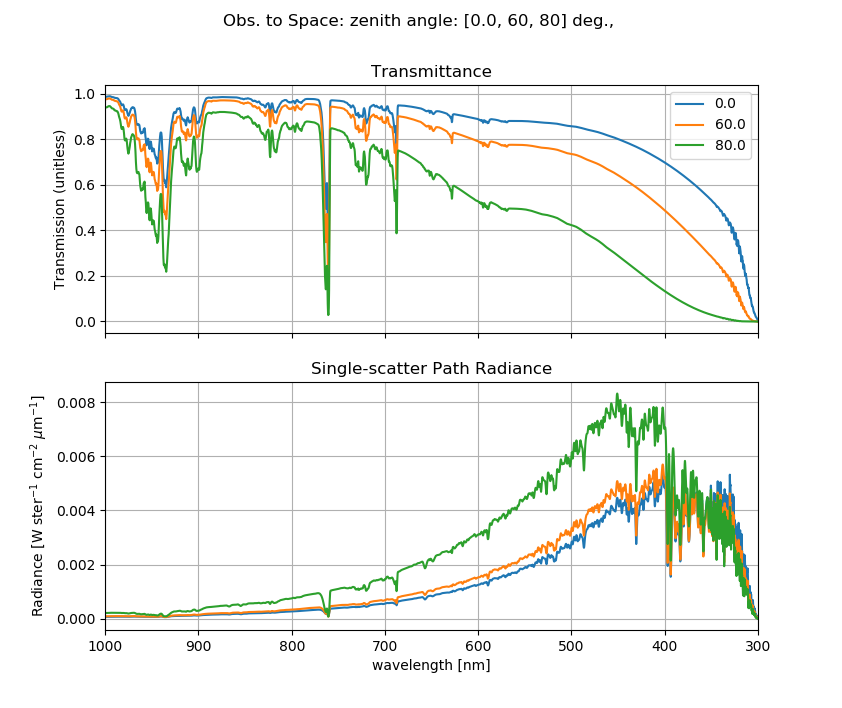
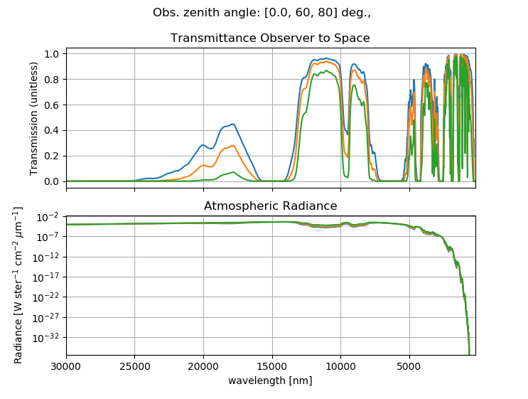

# Lowtran in Python

[](https://doi.org/10.5281/zenodo.213475)

[](http://pepy.tech/project/lowtran)

LOWTRAN7 atmospheric absorption extinction model.
Updated to be platform independent and easily accessible from Python and
[Matlab](#matlab).

The main LOWTRAN program is accessible from Python by using direct memory transfers instead of the cumbersome and error-prone process of writing/reading text files.
`xarray.Dataset` high-performance, simple N-D array data is passed out, with appropriate metadata.

## Gallery

See below for how to make these examples.



## Install

Lowtran requires a Fortran compiler and CMake.
We use `f2py` (part of `numpy`) to seamlessly use Fortran libraries from Python by special compilation of the Fortran library with auto-generated shim code.

1. If a Fortran compiler is not already installed, install Gfortran:

   * Linux: `apt install gfortran`
   * Mac: `brew install gcc`
   * Windows: use any one of Windows Subsystem for Linux, MSYS2, MinGW to get Gfortran or use Intel oneAPI.

Note: Cygwin is essentially obsolete due to Windows Subsystem for Linux. Cygwin is broken for Numpy and Gfortran and general.

2. Install Python Lowtran code

   ```sh
   pip install -e .
   ```

## Examples

In these examples, you can write to HDF5 with the `-o` option.

We present Python [examples](./example) of:

* ground-to-space transmittance: TransmittanceGround2Space.py

  
* sun-to-observer scattered radiance (why the sky is blue): ScatterRadiance.py

  
* sun-to-observer irradiance: SolarIrradiance.py

  
* observer-to-observer solar single-scattering solar radiance (up-going) with custom Pressure, Temperature and partial pressure for 12 species: UserDataHorizontalRadiance.py
  
* observer-to-observer transmittance with custom Pressure, Temperature and partial pressure for 12 species: UserDataHorizontalTransmittance.py
* observer-to-observer transmittance: HorizontalTransmittance.py

  

### Matlab

Matlab users can seamlessly access Python modules, as demonstrated in
[RunLowtran.m](./RunLowtran.m).

Here's what's you'll need:

1. [Setup Python &harr; Matlab interface](https://www.scivision.dev/matlab-python-user-module-import/).
2. Install Lowtran in Python as at the top of this Readme.
3. From Matlab, verify everything is working by:

   ```matlab
   runtests('lowtran')
   ```

## Notes

LOWTRAN7
[User manual](http://www.dtic.mil/dtic/tr/fulltext/u2/a206773.pdf)
Refer to this to understand what parameters are set to default.
Currently I don't have any aerosols enabled for example, though it's possible to add them into the code.

Right now a lot of configuration features aren't implemented, please request those you want.

### Reference

* Original 1994 Lowtran7 [Code](http://www1.ncdc.noaa.gov/pub/data/software/lowtran/)
* `LOWFIL` program in reference/lowtran7.10.f was not connected as we had previously implemented a filter function directly in  Python.
* `LOWSCAN` spectral sampling (scanning) program in `reference/lowtran7.13.f` was not connected as we had no need for coarser spectral resolution.
